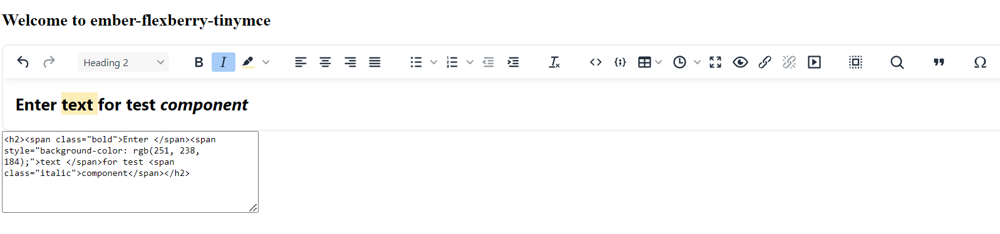

ember-flexberry-tinymce
==============================================================================

`ember-flexberry-tinymce` - аддон для [ember-flexberry](https://github.com/Flexberry/ember-flexberry/tree/develop) с WYSIWYG HTML редактором. 

Установка
------------------------------------------------------------------------------

```
ember install ember-flexberry-tinymce
```


Использование
------------------------------------------------------------------------------

`ember-flexberry-tinymce` - аддон для [ember-flexberry](https://github.com/Flexberry/ember-flexberry/tree/develop), позволяющий встроить в свое приложение WYSIWYG HTML редактор.

WYSIWYG (является аббревиатурой от англ. What You See Is What You Get, «что видишь, то и получишь») — свойство прикладных программ или веб-интерфейсов, в которых содержание отображается в процессе редактирования. Также широко используется понятие «визуальный редактор».

Редактор представляет из себя поле для ввода текста и функциями его редакирования, а также включает в себя получившуюся html разметку. Выглядит это следующим образом:


Разработка
------------------------------------------------------------------------------

### Установка

* `git clone <repository-url>`
* `cd ember-flexberry-tinymce`
* `npm install`

### Linting

* `npm run lint:js`
* `npm run lint:js -- --fix`

### Тестирование

* `ember test` – Runs the test suite on the current Ember version
* `ember test --server` – Runs the test suite in "watch mode"
* `ember try:each` – Runs the test suite against multiple Ember versions

### Запуск приложения

* `ember serve`
* Visit the dummy application at [http://localhost:4200](http://localhost:4200).

For more information on using ember-cli, visit [https://ember-cli.com/](https://ember-cli.com/).

License
------------------------------------------------------------------------------

This project is licensed under the [MIT License](LICENSE.md).
